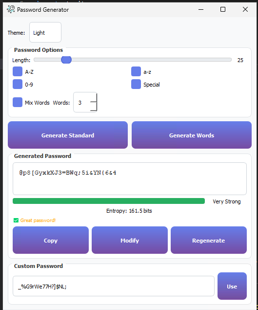
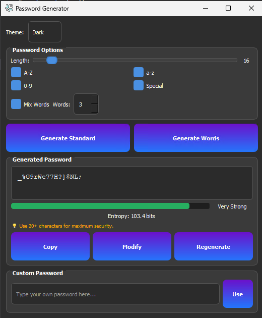

# 🔐 Password Generator

A modern, secure desktop password generator built with Python and PyQt5. Features a dark/light theme, entropy-based strength analysis, word-based passwords, and automatic clipboard clearing for security.


---

## 📸 Screenshot

| Light Theme | Dark Theme |
|---|---|
|  |  |

---

## ✨ Features

### 🔒 Security
- **Entropy Analysis** — calculates bits of entropy to mathematically measure crack resistance
- **Strength Meter** — live Weak / Fair / Strong / Very Strong scoring with color indicator
- **Common Password Detection** — flags passwords found in known breach lists
- **Auto-Clear Clipboard** — automatically wipes copied passwords after 30 seconds
- **Cryptographically Secure** — uses Python's `secrets` module, not `random`

### 🛠️ Password Types
- **Standard Passwords** — customizable length (8–127 chars) with character type selection
- **Word-Based Passwords** — combines random words with special characters and numbers
- **Custom Passwords** — type your own and get instant strength feedback

### 🎨 Interface
- **Dark & Light themes** — VS Code-inspired dark mode included
- **Live strength bar** — updates as you type or generate
- **Modify & Regenerate** — tweak existing passwords without starting over
- **Preferences saved** — remembers your theme and window size

---

## 🚀 Installation

### Prerequisites
- Python 3.6 or higher
- Windows OS (tested on Windows 10/11)

### Install dependencies
```bash
pip install pyqt5 psutil pywin32
```

### Run the app
```bash
python main.py
```

---

## 🧪 Testing

This project uses **pytest** with a full GitHub Actions CI pipeline that runs on every push.

### Run tests locally
```bash
pip install pytest
pytest
```

### Test coverage includes
| Area | Tests |
|---|---|
| Character pool building | 7 tests |
| Password generation | 9 tests |
| Entropy calculation | 5 tests |
| Strength scoring | 10 tests |
| Custom password validation | 7 tests |
| Word manager | 5 tests |

### CI Status


---

## 🔬 How Entropy Works

Entropy is calculated using the formula:

```
Entropy (bits) = Password Length × log₂(Character Pool Size)
```

| Pool | Size | 16-char entropy |
|---|---|---|
| Lowercase only | 26 | ~75 bits |
| Lower + Upper | 52 | ~91 bits |
| Lower + Upper + Numbers | 62 | ~95 bits |
| All character types | 89 | ~102 bits |

**General guidance:**
- < 40 bits — Very weak
- 40–60 bits — Fair
- 60–80 bits — Strong
- 80+ bits — Very Strong

---

## 🔧 Strength Scoring

Passwords are scored out of 100 based on:

- **Length** (up to 40 points) — longer is always better
- **Character variety** (up to 40 points) — mix of upper, lower, numbers, special
- **Entropy bonus** (up to 20 points) — rewards high mathematical complexity
- **Common password check** — instant 0 score if found in breach list

---

## 🛡️ Security Notes

- All passwords are generated using Python's `secrets` module which uses the OS cryptographic random source
- The clipboard is automatically cleared 30 seconds after copying
- Common passwords are checked against a built-in list of known weak passwords
- No passwords are stored, logged, or transmitted anywhere

---

## 📦 Dependencies

| Package | Purpose |
|---|---|
| `PyQt5` | GUI framework |
| `psutil` | System process info |
| `pywin32` | Windows API integration |
| `secrets` | Cryptographic random (built-in) |
| `string` | Character sets (built-in) |
| `pathlib` | File path handling (built-in) |

---

## 🤝 Contributing

Pull requests are welcome! Please ensure all tests pass before submitting:

```bash
pytest
```

---

## 📄 License

This project is licensed under the MIT License — see the [LICENSE](LICENSE) file for details.

---

## 👤 Author

**Tezz** — Automation Engineer | Python & Next.js Developer

[](https://linkedin.com/in/letezz-khan-722397159/)
[](mailto:letezzkhan@gmail.com)

